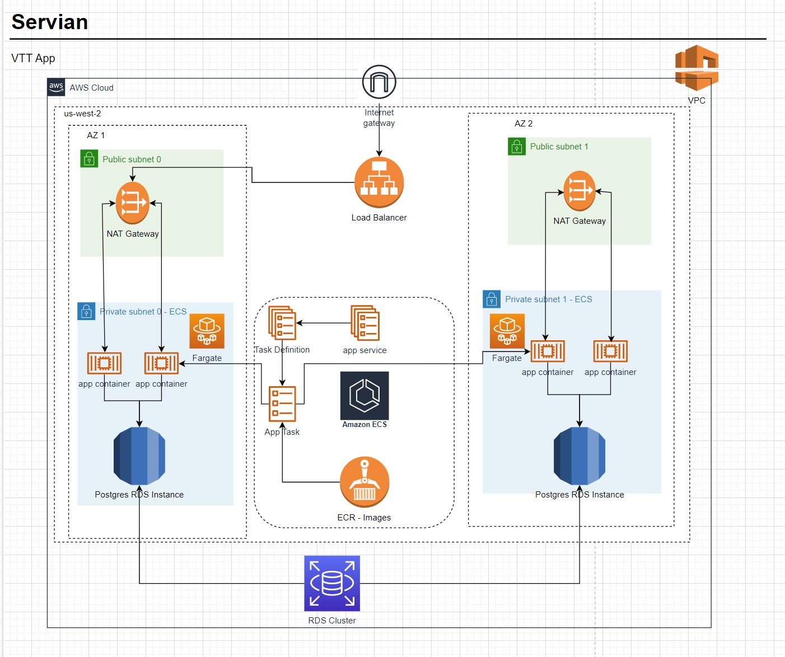

# Servian DevOps Tech Challenge - Tech Challenge App

## Detailed Readme for application refer

## Overview

This document has the details about the build, creating infra, platform and deploying application in AWS ECS Fargate.

More details about the application can be found in the [document folder](doc/readme.md)

## Architecture Diagram for this AWS setup

## Running the build
Run the following commands to trigger the build, checkout this git repository first.

`git clone https://github.com/agvikashsagar/TechChallengeApp.git`

`podman build -f Dockerfile-Updated  . -t <ecr-repository>`
`aws ecr-public get-login-password --region us-east-1 | podman login --username AWS --password-stdin <ecr-repository>`

Note:  aws version 2 and above is required to run the above command. 

## Creating the underlying Infra in AWS

Run the following commands to create the infra in aws

`cd terraform/infra`

`terraform init`
`terraform plan`
`terraform apply -auto-approve`

Following aws infrastruture components will be created as part of the infra terraform files.

* VPC                       
* Public subnet 3           - Public-Subnet-1, Public-Subnet-2, Public-Subnet-3
* Private subnet 3          - Private-Subnet-1, Private-Subnet-2, Private-Subnet-3
* db subnet                 - Private-Subnet-1, Private-Subnet-2, Private-Subnet-3
* Route table               - Public-Route-Table
* Route table               - Private-Route-Table
* internetgateway           - IGW
* NAT Gateway               - NGW
* EIP                       - EIP for NAT

## Creating the underlying Platform in AWS

Run the following commands to create the underlying platform in aws

`cd terraform/platform`

`terraform init`
`terraform plan`
`terraform apply -auto-approve`

Following aws infrastruture components will be created as part of the infra terraform files.

* Security Groups           - RDS, ALB, ECS cluster    
* ECS Cluster                   
* RDS Instance              - RDS Postgres Instance

## Deploying the application in AWS

Run the following commands to create the underlying platform in aws

`cd terraform/application`

`terraform init`
`terraform plan`
`terraform apply -auto-approve`

Following aws infrastruture components will be created as part of the infra terraform files.

* ECS Service          - app service (2 instances of container), db service (0 instances)
* Task                 - ECS Tasks to run application
* Task Definition      - ECS Task definition for application
* Cloud watch stream   - Cloud watch stream

To apply and destory terraform resources in single command.
`cd terraform`
`apply.bat`
`destroy.bat`